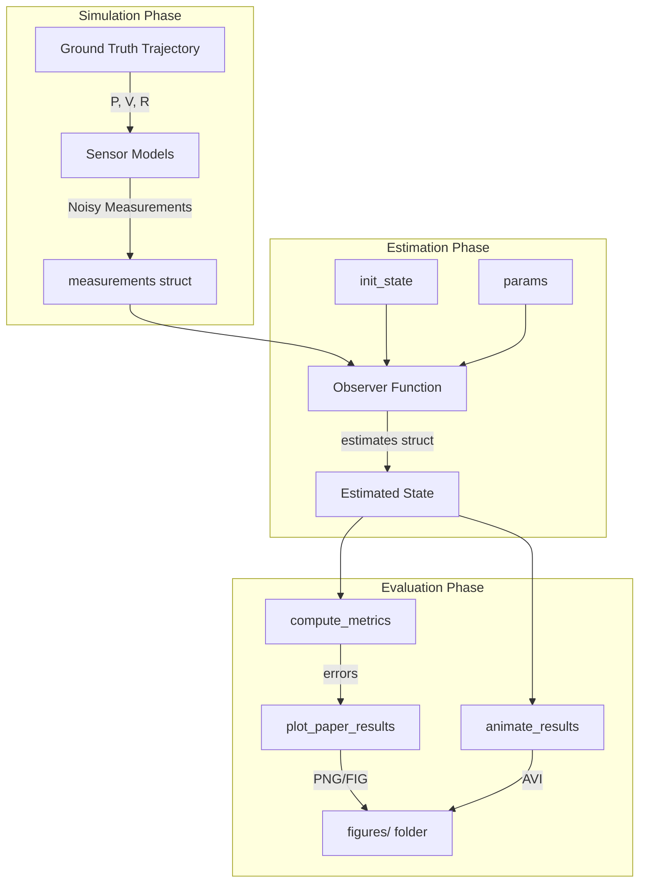
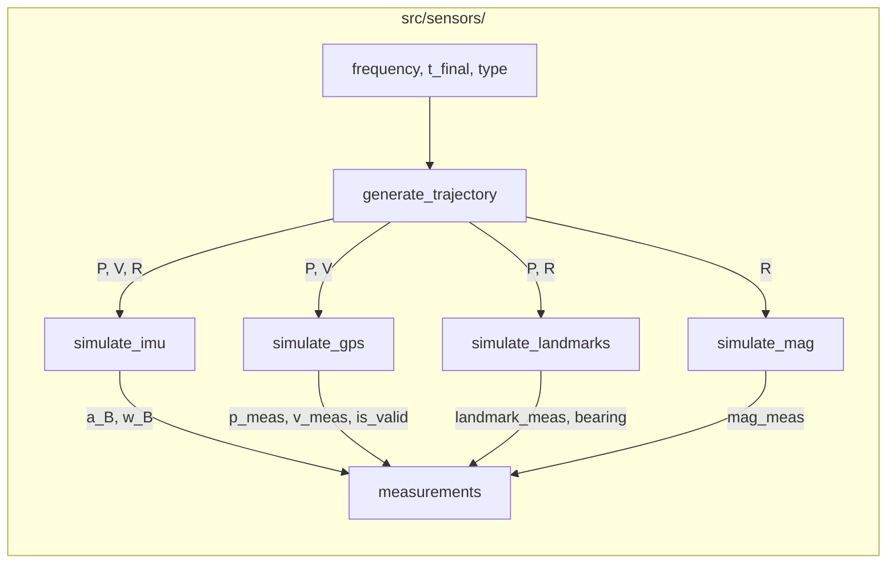
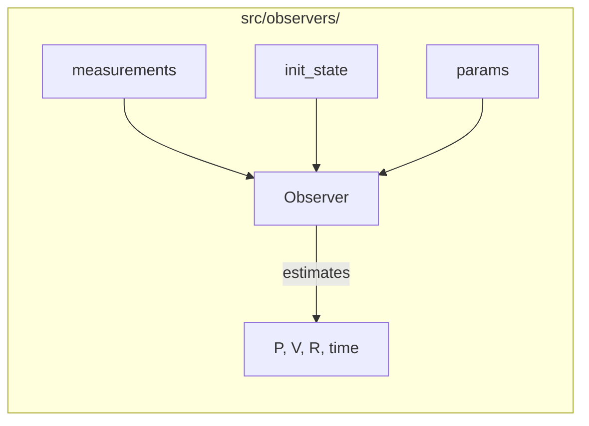
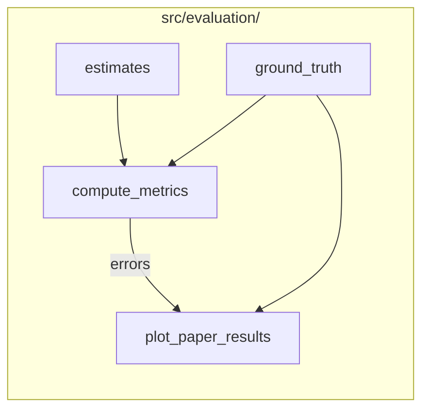

# Refactored INS Simulation Suite

A modular, research-grade MATLAB framework for designing, testing, and comparing **Inertial Navigation System (INS) observers**.

> **Welcome, student!** This repository was built so you can focus 100% on the mathematics of your observer — not on boilerplate code. Everything you need (sensors, metrics, plots, animations) is already written for you.

---

## Repository Architecture

### Global Data Flow


### Folder Breakdown

#### 1. `src/sensors/` (Data Generation)
Generates ground truth and simulates noisy sensor readings.


#### 2. `src/observers/` (The Math)
Where the actual filters are implemented.


#### 3. `src/evaluation/` (Analysis)
Computes errors and generates publication-quality plots.


#### 4. `src/animation/` & `src/utils/`
- **`src/animation/animate_results.m`**: Generates high-fidelity 3D AVI videos.
- **`src/utils/ALLFUNCS.m`**: Centralized library for SO(3) math (`skew`, `Rexp`, etc).

#### 5. `tests/`
All top-level scripts to run individual tests or side-by-side comparisons.
- `compare_observers.m`: ⭐ Use this for benchmarking.
- `test_generic_observer.m`: Verifies the LPV filter.
- `test_ekf_observer.m`: Verifies the EKF baseline.


---

## How to Add Your Own Observer (Step by Step)

### Step 1 — Copy the Template
In MATLAB's file browser, copy `src/observers/observer_template.m` and rename it, e.g., `src/observers/my_observer.m`.

### Step 2 — Understand the Contract
Your observer function **must** follow this exact signature:
```matlab
function estimates = my_observer(measurements, init_state, params)
```

**`measurements`** — Contains all sensor data, ready to use:
| Field | Contents |
|---|---|
| `measurements.imu.a_B` | Accelerometer readings (body frame), 3×N |
| `measurements.imu.w_B` | Gyroscope readings (body frame), 3×N |
| `measurements.imu.time` | IMU time vector, 1×N |
| `measurements.gps.p_meas` | GPS position, 3×M |
| `measurements.gps.v_meas` | GPS velocity, 3×M |
| `measurements.gps.is_valid` | Boolean validity flag (false during outage), 1×M |
| `measurements.gps.time` | GPS time vector, 1×M |
| `measurements.cam.landmark_meas` | Stereo landmark positions (body frame), 3×K×L |
| `measurements.cam.positions_I` | Landmark inertial positions, 3×L |
| `measurements.cam.time` | Camera time vector, 1×K |

**`init_state`** — Initial conditions:
- `init_state.P` → 3×1 initial position (with noise)
- `init_state.V` → 3×1 initial velocity (with noise)
- `init_state.R` → 3×3 initial rotation matrix (with small error)

**`params`** — Observer tuning parameters:
- `params.g_vec` → Gravity vector `[0;0;-9.81]`
- `params.Q_gps` → GPS noise covariance (3×3)
- `params.Q_cam` → Camera noise covariance (3×3)
- *(Add your own tuning parameters here, e.g. `params.P0`, `params.k_att`)*

**`estimates`** — Your output struct **must** contain exactly:
| Field | Contents |
|---|---|
| `estimates.P` | 3×N estimated inertial position |
| `estimates.V` | 3×N estimated inertial velocity |
| `estimates.R` | 1×N cell array of 3×3 rotation matrices |
| `estimates.time` | 1×N time vector (copy from `measurements.imu.time`) |

### Step 3 — Use the Utility Functions
The `ALLFUNCS` class is available to all code in `src/`. Use it instead of rewriting math:
```matlab
S   = ALLFUNCS.skew(v);           % 3x1 → 3x3 skew-symmetric matrix
R   = ALLFUNCS.Rexp(omega * dt);  % R^3 → SO(3) exponential map
R   = ALLFUNCS.orthogonalize(R);  % Force R back onto SO(3) after drift
y   = ALLFUNCS.sincc(alpha);      % sin(x)/x, safe at x=0
```

### Step 4 — Write Your Test Script
Copy `tests/test_ekf_observer.m` → `tests/test_my_observer.m`.

Change **only** the two lines that reference the observer name:
```matlab
% Line ~70: run your observer
estimates = my_observer(measurements, init_state, params);

% Line ~90: give it a name for the legend
plot_paper_results(ground_truth, estimates, errors, 'My Observer');
```

Run it from MATLAB with `cd tests; run('test_my_observer.m')`. A 2×2 metric figure and an animated `.avi` will be automatically saved in `../figures/`.

### Step 5 — Compare Against the Benchmarks
Open `tests/compare_observers.m`. Find the comparison block near the end and add your observer:

```matlab
%% 4. Run Observers
est_generic = generic_observer(measurements, init_state, params);
est_ekf     = ekf_observer(measurements, init_state, params);
est_mine    = my_observer(measurements, init_state, params);   % ← ADD HERE

%% 5. Compute Metrics
...
[err_mine, rmse_mine] = compute_metrics(gt_downsampled, est_mine); % ← ADD

%% 6. Plot Comparison
estimates_list = {est_generic, est_ekf, est_mine};         % ← ADD
errors_list    = {err_generic, err_ekf,  err_mine};        % ← ADD
legend_names   = {'Generic', 'EKF', 'My Observer'};        % ← ADD
plot_paper_results(ground_truth, estimates_list, errors_list, legend_names);
```

One command generates a unified comparison figure where all observers are **overlaid in the same 2×2 plot** with auto-assigned distinct colors.

---

## What You Don't Have to Write

Thanks to the modular architecture:

| Task | You need to write it? |
|---|---|
| IMU / GPS / Camera sensor models | ❌ Already done |
| Ground truth trajectory generation | ❌ Already done |
| GPS outage models | ❌ Already done |
| Geometric error metrics (position, velocity, attitude) | ❌ Already done |
| RMSE computation | ❌ Already done |
| Publication-quality 2×2 metric figure | ❌ Already done |
| 3D animated video of trajectory + attitude | ❌ Already done |
| Multi-observer comparison figure | ❌ Already done |
| SO(3) math utilities | ❌ Already done |
| **Your observer's filter equations** | ✅ This is your contribution! |

---

## Running the Benchmarks

```matlab
% From the MATLAB command window, navigate to the tests/ folder first:
cd /path/to/Refactored_INS/tests

% Run a single observer test
run('test_generic_observer.m')

% Run the full benchmark comparison (all observers)
run('compare_observers.m')
```

All output figures and videos are automatically saved to `../figures/`.

---

## Key References

- **Generic Observer (LPV):** Martin, P., & Salaün, E. — *Generalized Multiplicative Extended Kalman Filter*
- **Error-State EKF:** Joan Solà — *Quaternion kinematics for the error-state Kalman filter* (2017)
- **Rodrigues' Formula:** `ALLFUNCS.Rexp()` implements the exact closed-form exponential map on SO(3)
